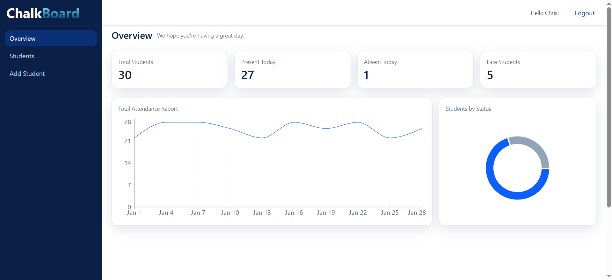
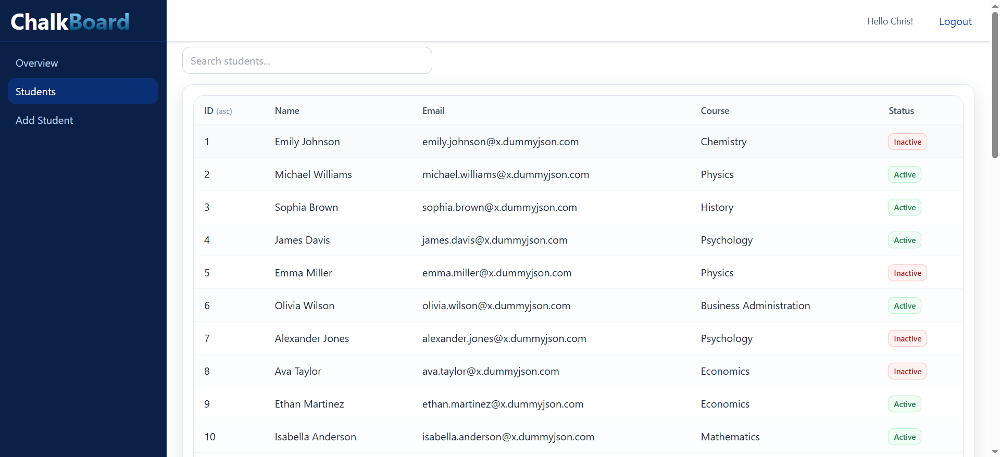
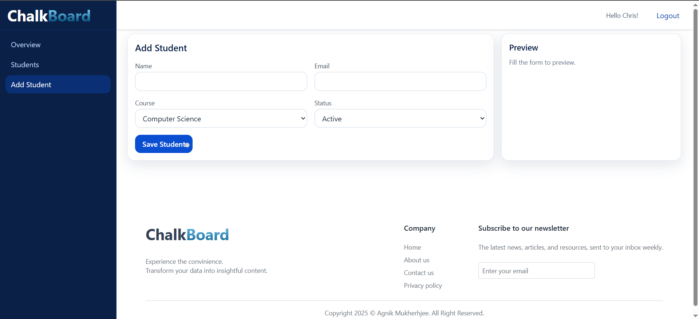

# 📚 Student Management Dashboard

A responsive student management dashboard built with **React + TailwindCSS**.  
It includes authentication, global search, sorting, and adding new data for student records.  

---

## 🚀 Features
- 📈Insighful dashboard
- 📊 Student list with sorting & filtering
- ✒Can add new stident data   
- 📱 Responsive layout with sidebar + navbar  
- 🌓 Modern UI with TailwindCSS  
- 🔑 Authentication context (login/logout)

---

## 🛠️ Tech Stack
- **Frontend:** React, TailwindCSS  
- **State Management:** React Context API  
- **Icons & UI:** Custom Components + Tailwind  
- **Build Tool:** Vite 

---

## ⚙️ Setup Instructions

### 1️⃣ Clone the repository
```bash
git clone https://github.com/AgnikMukherjee/ChalkBoard.git
cd student-dashboard

--- 


2️⃣ Install dependencies
npm install
npm run dev


## 📸 Screenshots

### Dashboard


### Students List


### Pagination


### Login


